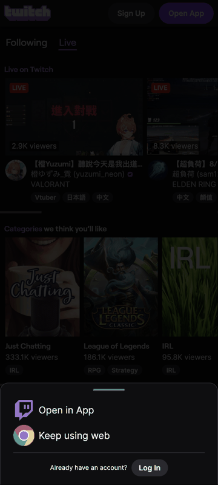

# Twitch WAP Automation (Selenium + pytest, mobile emulation)

Automated UI test for the **Twitch mobile web (WAP)** site, driven by Selenium
through **Google Chrome's mobile emulator** and run with **pytest**. It is built
as a small, scalable framework (Page Object Model + fixtures + env-driven
config), not a one-off script — adding a new page or scenario is a few lines.

## The scenario

| Step | Action | Where it lives |
|------|--------|----------------|
| 1 | Go to Twitch | `HomePage.load()` |
| 2 | Click the search icon | `HomePage.search()` |
| 3 | Input `StarCraft II` | `HomePage.search()` |
| 4 | Scroll down 2 times | `SearchResultsPage.scroll()` |
| 5 | Select one streamer | `SearchResultsPage.open_first_streamer()` |
| 6 | Wait until loaded, handle any pop-up, take a screenshot | `ChannelPage.wait_until_loaded()` + `take_screenshot()` |

## Demo (test running locally)



*(Frames: home → search results → after scroll → streamer page. Regenerate with
`python tools/make_gif.py`.)*

## Repository structure

```
twitch-wap-automation/
├── config/
│   └── settings.py          # env-driven config (URL, device, timeouts, term...)
├── framework/
│   ├── driver_factory.py    # Chrome + mobile emulation; Selenium Manager driver
│   └── base_page.py         # shared waits/clicks/scroll/pop-up primitives
├── pages/                   # Page Object Model
│   ├── home_page.py         # landing + search entry (steps 1–3)
│   ├── search_page.py       # results, scroll, pick streamer (steps 4–5)
│   └── channel_page.py      # streamer page: pop-ups, wait, screenshot (step 6)
├── tests/
│   └── test_starcraft_stream.py   # the scenario, mapped 1:1 to the steps
├── tools/
│   └── make_gif.py          # stitch step screenshots → README gif (Pillow only)
├── artifacts/               # screenshots, run.gif, pytest-html report
├── conftest.py              # driver/artifact fixtures + screenshot-on-failure
├── pytest.ini
└── requirements.txt
```

## Prerequisites

- **Python 3.10+**
- **Google Chrome** installed (any recent version). The matching `chromedriver`
  is downloaded automatically by **Selenium Manager** — no manual driver setup.

## Setup & run

```bash
python3 -m venv .venv
source .venv/bin/activate          # Windows: .venv\Scripts\activate
pip install -r requirements.txt

pytest                             # runs the scenario (headed by default)
HEADLESS=true pytest               # run headless (CI)
```

Artifacts land in `artifacts/`:
- `01_home.png … 04_streamer_page.png` — one screenshot per step
- `report.html` — self-contained pytest-html report
- `FAILURE_<test>.png` — captured automatically if a test fails

## Configuration

Everything is overridable via environment variables (defaults in
`config/settings.py`), so the same suite runs on a laptop, in CI, or against a
different device/locale without code changes:

| Env var | Default | Purpose |
|---------|---------|---------|
| `TWITCH_BASE_URL` | `https://www.twitch.tv/` | Entry URL (redirects to `m.twitch.tv` under emulation) |
| `SEARCH_TERM` | `StarCraft II` | What to search for |
| `DEVICE_NAME` | `Pixel 7` | Any Chrome DevTools device (`iPhone 12 Pro`, …) |
| `HEADLESS` | `false` | Headless Chrome |
| `SCROLL_TIMES` | `2` | How many times to scroll the results |
| `EXPLICIT_WAIT` | `25` | Default explicit-wait timeout (s) |
| `PAGE_LOAD_TIMEOUT` | `60` | Page-load timeout (s) |
| `PLAYER_SETTLE` | `4.0` | Settle time on the streamer page (s) |
| `ARTIFACTS_DIR` | `artifacts` | Where screenshots/reports go |

## Design notes (scalability & maintainability)

- **Mobile emulation** — `driver_factory.py` uses Chrome's
  `mobileEmulation` (`deviceName`), which is exactly the "Mobile emulator from
  Google Chrome" the brief requires. Switching device = one env var.
- **Page Object Model** — each page exposes intent (`search`, `scroll`,
  `open_first_streamer`), not selectors. Selectors are declared at the top of
  each page and nowhere else, so a Twitch redesign is a one-file fix.
- **Resilient locators** — we prefer stable `data-a-target` hooks and href
  patterns over hashed CSS class names, and every locator has fallbacks. Channel
  selection targets the **Channels tab**, where each streamer is a real
  `/{channel}` link (the "Top" tab renders cards as non-anchor widgets).
- **Pop-up handling** — `BasePage.try_click()` is a best-effort click used by
  `ChannelPage.dismiss_popups()` to clear the consent banner, the
  mature-content / content-classification gate, and app-upsell sheets, whether
  or not they appear (the "handle the pop-up before the video" requirement).
- **Fixtures & reporting** — `conftest.py` owns driver lifecycle, a per-step
  `artifact()` screenshot helper, and an auto-screenshot-on-failure hook;
  `pytest-html` produces a shareable report.
- **Zero manual driver management** — Selenium Manager resolves `chromedriver`.

## Extending

- **New page**: subclass `BasePage`, declare locators, expose intent methods.
- **New test**: drop a `tests/test_*.py`; reuse the `driver` / `artifact`
  fixtures. Data (search terms, devices) comes from env/config, so the same
  test can be parametrized across devices in CI.

## Notes / known limitations

- Under mobile emulation, `twitch.tv` redirects to **`m.twitch.tv`** (the WAP
  app) — this is the "correct (WAP) version" from the brief.
- On the **unauthenticated** mobile web app Twitch usually does **not** mount a
  live `<video>` element (it nudges users to the native app), so step 6 waits on
  the channel header rather than a playing video, then screenshots. The selected
  streamer is the first StarCraft II channel result and may be live or
  recently-live.
- Twitch's DOM is React and A/B-tested; locators may drift over time — they are
  centralized per page precisely so that maintenance is cheap. Twitch also
  employs bot detection; the driver reduces the obvious automation signals and
  the suite runs headed by default for reliability.
```
